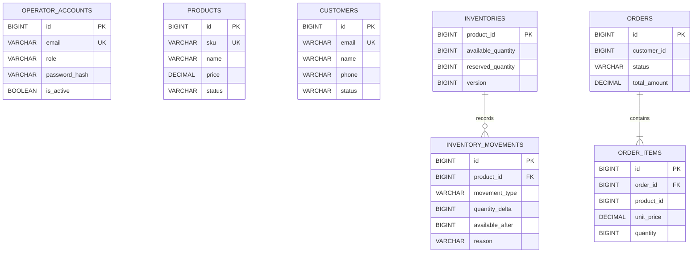

# 데이터베이스 구조

플랫폼은 MySQL 안에서 서비스별 데이터베이스와 계정을 분리한다. C#은 `commerce_operations`, Java는 `commerce_order_engine`만 직접 사용하며 서비스 간 연동은 REST API로만 수행한다.



## `commerce_operations`

- `operator_accounts`: 운영자 이메일, 표시 이름, 역할, PBKDF2 비밀번호 해시, 활성 상태
- `products`: 대문자로 정규화되는 고유 SKU, 상품명, 0 이상 가격, `ACTIVE`/`INACTIVE` 상태
- `customers`: 소문자 이메일, 이름, 정규화된 전화번호, `ACTIVE`/`SUSPENDED`/`WITHDRAWN` 상태
- `service_metadata`: 서비스 식별 정보
- `schema_migrations`: 적용된 명시적 SQL 마이그레이션 기록
- `audit_logs`: 운영자 변경 요청의 경로, 자원, 결과, 처리시간과 접속 정보

마이그레이션은 `V001__baseline.sql`부터 `V005__audit_logs.sql`까지 적용된다.

## `commerce_order_engine`

### `inventories`

상품별 현재 재고다. `product_id`는 Operations DB 상품 ID의 논리 참조이며 데이터베이스 간 외래 키는 없다. 가용·예약 수량에는 0 이상 제약이 있고 조정 때 `version`이 증가한다.

### `inventory_movements`

재고 생성과 조정 이력이다. 같은 데이터베이스의 `inventories.product_id`를 참조하며 유형, 증감량, 변경 후 수량, 사유와 시각을 기록한다.

### `orders`, `order_items`

주문 헤더와 주문 시점의 상품 스냅샷을 저장한다. `customer_id`와 `product_id`는 Operations DB의 논리 참조이며 데이터베이스 간 외래 키는 없다. `order_items.order_id`만 같은 Java DB의 `orders.id`를 외래 키로 참조한다. 주문 상태는 `CREATED`, `CANCELLED`다.

### `payment_transactions`, `order_event_outbox`

결제·환불 승인 기록과 RabbitMQ 전달 대기 이벤트를 저장한다. 결제 거래는 주문 금액 전체를 기록하며, Outbox는 주문 변경과 같은 트랜잭션에서 생성된 후 발행 성공 시 `published_at`이 설정된다. Phase 7 주문 상태는 `CREATED`, `PAID`, `CANCELLED`, `REFUNDED`다.

### `shipments`

주문별 운송사, 송장번호, 배송·완료 시각을 저장한다. 주문 하나에 배송 한 건만 허용하며 `(carrier, tracking_number)`도 고유하다. Phase 8 주문 상태는 `CREATED`, `PAID`, `SHIPPED`, `COMPLETED`, `CANCELLED`, `REFUNDED`다.

### `daily_sales_summaries`

UTC 정산일을 PK로 결제 승인액·환불액·순매출과 각 건수를 저장한다. 결제 원장을 기준으로 재계산하고 같은 날짜를 Upsert하므로 반복 실행해도 중복 합산되지 않는다.

### 시스템 테이블

- `service_metadata`: 서비스 식별 정보
- `flyway_schema_history`: Flyway 적용 이력

Flyway `V1__baseline.sql`은 기준 테이블을, `V2__inventories.sql`은 재고 테이블을, `V3__orders.sql`은 주문 테이블과 예약 이력 유형을, `V4__payments_and_outbox.sql`은 결제와 Outbox를, `V5__shipments.sql`은 배송 정보를, `V6__daily_sales_summaries.sql`은 일별 정산을 생성한다. 적용된 마이그레이션 파일은 수정하지 않고 다음 버전 파일을 추가한다.

## DataGrip 연결

로컬 기본 포트는 3306이며 비밀번호는 `.env.local`에서 확인한다.

| 데이터베이스 | JDBC URL | 계정 환경 변수 |
|---|---|---|
| Operations | `jdbc:mysql://localhost:3306/commerce_operations` | `MYSQL_OPERATIONS_USER` / `MYSQL_OPERATIONS_PASSWORD` |
| Order Engine | `jdbc:mysql://localhost:3306/commerce_order_engine` | `MYSQL_ORDER_USER` / `MYSQL_ORDER_PASSWORD` |

```sql
SHOW TABLES;
SELECT * FROM schema_migrations ORDER BY version;
SELECT * FROM flyway_schema_history ORDER BY installed_rank;
SELECT * FROM inventories ORDER BY product_id;
SELECT * FROM inventory_movements ORDER BY id DESC;
```

`scripts/reset-local.ps1`은 MySQL 볼륨과 모든 로컬 데이터를 삭제한다. 데이터를 유지하려면 `stop-local.ps1`만 사용한다.
