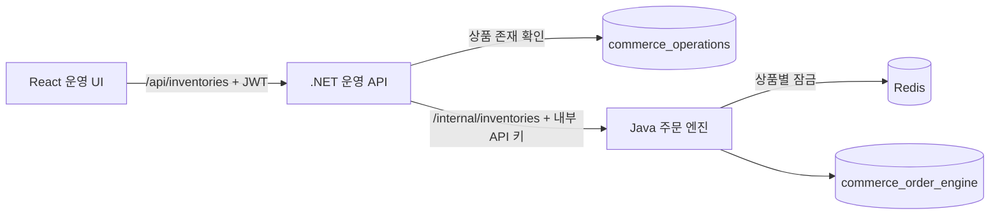

# Phase 5 재고 관리

## 제공 기능

- 상품별 재고 생성과 목록 조회
- 가용 수량 증감 및 음수 재고 차단
- 생성·조정 이력 조회
- Redis 상품별 분산 잠금
- 운영자 JWT 및 변경 작업의 `ADMIN` 권한 확인

예약 재고와 주문 처리는 Phase 6 범위다.

## 호출 흐름과 소유권



React는 Java를 직접 호출하지 않는다. C# API가 상품의 존재 여부를 확인하고 Java 내부 API를 호출한다. Java만 `inventories`와 `inventory_movements`를 직접 읽고 변경한다. 서비스 간 데이터베이스 외래 키는 없다.

## 데이터베이스

`V2__inventories.sql` Flyway 마이그레이션이 다음 테이블을 생성한다.

### `inventories`

| 열 | 의미 |
|---|---|
| `product_id` | 상품 식별자이자 PK. Operations DB에 대한 논리 참조 |
| `available_quantity` | 주문에 사용할 수 있는 수량, 0 이상 |
| `reserved_quantity` | 예약된 수량, 현재 단계에서는 0 |
| `version` | 수량 변경 때 증가하는 버전 |
| `created_at`, `updated_at` | 생성·최종 변경 시각 |

### `inventory_movements`

| 열 | 의미 |
|---|---|
| `id` | 변경 이력 PK |
| `product_id` | `inventories.product_id` 외래 키 |
| `movement_type` | `INITIAL` 또는 `ADJUSTMENT` |
| `quantity_delta` | 증감량 |
| `available_after` | 변경 후 가용 수량 |
| `reason` | 변경 사유 |
| `created_at` | 변경 시각 |

## API

운영 UI용 C# API:

- `GET /api/inventories?page=1&pageSize=20`
- `POST /api/inventories`
- `POST /api/inventories/{productId}/adjustments`
- `GET /api/inventories/{productId}/movements`

Java의 `/internal/inventories` API는 외부 UI용이 아니며 `X-Internal-Api-Key`가 필요하다. 키는 `.env.local`의 `INTERNAL_API_KEY`에서 주입한다.

## DataGrip 확인 쿼리

```sql
USE commerce_order_engine;
SELECT * FROM inventories ORDER BY product_id;
SELECT * FROM inventory_movements ORDER BY id DESC;
SELECT * FROM flyway_schema_history ORDER BY installed_rank;
```
