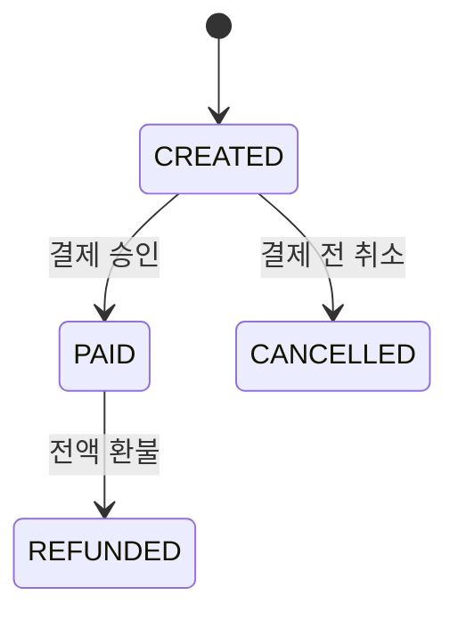

# Phase 7 로컬 결제와 주문 이벤트

## 제공 기능

- `CREATED` 주문의 로컬 결제 승인과 `PAID` 전환
- `PAID` 주문의 전액 환불과 `REFUNDED` 전환
- 환불 시 예약 재고를 가용 재고로 복원
- 결제·환불 거래번호와 금액 감사 기록
- 트랜잭션 Outbox 기반 RabbitMQ 주문 이벤트 발행

실제 카드사나 외부 PG는 연결하지 않는다. 현재 결제는 로컬 개발용 승인 시뮬레이션이며 부분 결제·부분 환불은 지원하지 않는다.

## 상태 전이

`CREATED`와 `PAID`에서는 재고가 예약되어 있다. `CANCELLED`와 `REFUNDED`로 전환하면 예약 수량이 가용 수량으로 돌아간다.

## 데이터와 메시지

Flyway `V4__payments_and_outbox.sql`이 `payment_transactions`, `order_event_outbox`를 생성한다. 주문 생성·결제·환불과 Outbox 저장은 같은 MySQL 트랜잭션에 포함된다. 백그라운드 발행기가 미발행 행을 RabbitMQ `commerce.orders` Topic Exchange로 보내고 성공한 행의 `published_at`을 기록한다.

이벤트 유형은 `ORDER_CREATED`, `ORDER_PAID`, `ORDER_REFUNDED`이며 로컬 감사 큐 `commerce.orders.audit`가 `order.#` 라우팅 키를 구독한다.

## API

- `POST /api/orders/{id}/pay`
- `POST /api/orders/{id}/refund`

두 API 모두 운영자 JWT와 `ADMIN` 권한이 필요하다.
