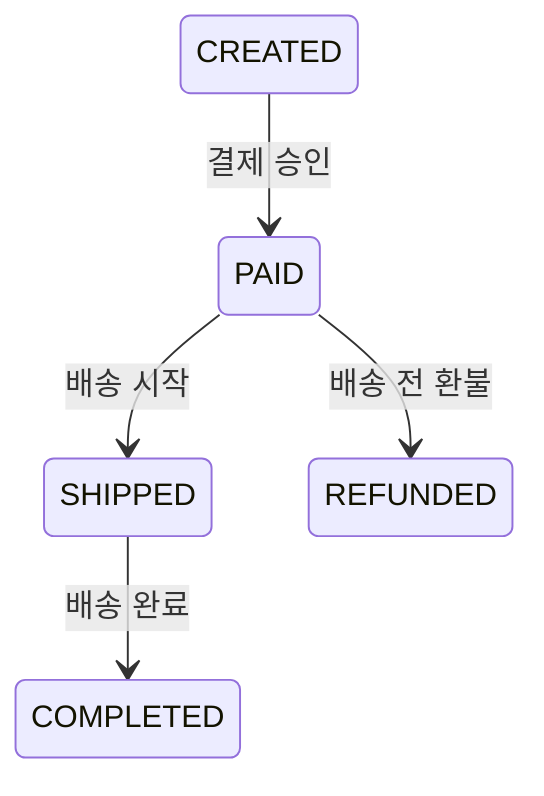

# Phase 8 배송과 주문 완료

## 제공 기능

- `PAID` 주문에 운송사와 송장번호를 등록해 배송 시작
- `SHIPPED` 주문의 배송 완료 처리
- 배송 시작 시 예약 재고를 실제 판매 수량으로 소진
- 배송·완료 이벤트를 Transactional Outbox와 RabbitMQ로 발행

외부 택배사 조회 API는 연결하지 않으며 운영자가 로컬 화면에서 배송 상태를 변경한다.

## 상태 전이

배송 시작 시 `reserved_quantity`가 주문 수량만큼 감소한다. 이미 주문 생성 시 감소한 `available_quantity`는 다시 변경하지 않는다. 재고 이력에는 `FULFILLMENT`가 기록된다. 배송이 시작된 주문은 현재 단계에서 환불할 수 없다.

## 데이터와 API

Flyway `V5__shipments.sql`이 `shipments` 테이블을 만들고 주문·재고 이력 상태 제약을 확장한다.

- `POST /api/orders/{id}/ship`: `{ "carrier": "LOCAL", "trackingNumber": "TRACK-123" }`
- `POST /api/orders/{id}/deliver`

RabbitMQ 이벤트는 `ORDER_SHIPPED`, `ORDER_COMPLETED`다.
