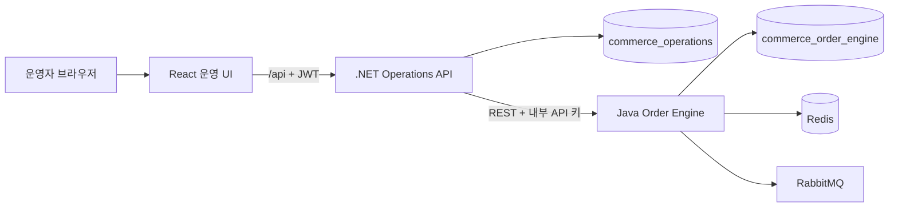

# 기술 스택과 기능별 적용

이 문서는 Commerce Operations Platform에서 사용한 기술의 역할과 실제 적용 기능을 설명한다. 전체 호출 구조는 [아키텍처](architecture.md), 테이블과 데이터 소유권은 [데이터베이스 구조](database-schema.md)를 함께 참고한다.

## 전체 구성

- React는 C# `/api`만 호출하며 Java를 직접 호출하지 않는다.
- C#은 인증, 상품·회원, 감사 로그와 공개 API 경계를 소유한다.
- Java는 재고·주문·결제·배송·정산과 주문 이벤트를 소유한다.
- 서비스는 상대 서비스의 테이블을 직접 읽지 않고 REST API로만 연동한다.

## .NET 운영 API

| 기술 | 설명 | 프로젝트 적용 |
|---|---|---|
| .NET 8 / C# 12 | 운영 API 실행 플랫폼과 언어 | 인증, 상품·회원, 대시보드 통합, 감사 로그, Java API 게이트웨이 |
| ASP.NET Core | HTTP API, 미들웨어, 인증·인가, 상태 점검 | `/api` 엔드포인트, JWT 보호, `ADMIN` 권한, `/health/live`, `/health/ready` |
| Dapper | 명시적 SQL 결과를 C# 객체로 매핑하는 경량 데이터 접근 도구 | 운영자, 상품, 회원, 감사 로그, Operations 대시보드 지표 조회·저장 |
| MySqlConnector | .NET용 MySQL 드라이버 | `commerce_operations` 연결과 트랜잭션 실행 |
| FluentValidation | 요청 모델 검증 | 상품 가격·SKU, 회원 이메일·전화번호, 주문·재고·배송 요청의 형식과 범위 검증 |
| JWT Bearer | 서명된 액세스 토큰 인증 | 로그인 토큰 발급, `/api/auth/me`, 보호 API 사용자·역할 확인 |
| PBKDF2-SHA256 | 비밀번호 단방향 해시 | 무작위 salt와 210,000회 반복으로 운영자 비밀번호 저장·검증 |
| Serilog | 구조화된 애플리케이션 및 요청 로그 | 요청 경로, 상태 코드, 처리시간, 예외, Correlation ID 기록 |
| Swagger / OpenAPI | API 확인 및 로컬 호출 문서 | `http://localhost:5000/swagger`에서 공개 API 확인 |
| ASP.NET Rate Limiter | 과도한 요청 제한 | 로그인 요청을 분당 10회로 제한하고 초과 시 `429` 반환 |

### 서비스 간 호출과 재시도

C#은 회원·상품의 존재와 상태를 자기 DB에서 확인한 다음 Java 내부 API를 호출한다. 내부 호출에는 `.env.local`의 `INTERNAL_API_KEY`를 `X-Internal-Api-Key`로 전달한다.

Java로 보내는 `GET` 요청만 네트워크 오류, `408`, `429`, `5xx`에 대해 짧은 간격으로 재시도한다. 주문 생성, 결제, 환불, 배송 같은 변경 요청은 중복 실행 위험이 있어 자동 재시도하지 않는다. `Polly.Extensions.Http` 패키지가 포함되어 있으며 현재 안전한 조회 재시도 규칙은 전용 HTTP 처리기에서 명시적으로 제어한다.

### 감사와 요청 추적

- 인증된 운영자의 `POST`, `PUT`, `PATCH`, `DELETE` 요청을 `audit_logs`에 기록한다.
- 운영자, 경로, 자원, 결과 상태, 처리시간, IP와 User-Agent를 남긴다.
- 비밀번호, JWT, 내부 API 키와 요청·응답 본문은 기록하지 않는다.
- `X-Correlation-ID`를 C# 로그에 넣고 Java 호출에도 전달해 하나의 요청을 서비스 간 추적한다.

## Java 주문 엔진

| 기술 | 설명 | 프로젝트 적용 |
|---|---|---|
| Java 21 | 주문 엔진 구현 언어 | 재고, 주문, 결제, 배송, 정산과 이벤트 처리 |
| Spring Boot 3 | 내부 REST 서비스 실행 기반 | 내부 API, 설정 주입, 트랜잭션, 스케줄링, 상태 점검 |
| Spring Web | HTTP 컨트롤러와 JSON 처리 | C#에서 호출하는 `/internal` API와 OpenAPI 문서 |
| Spring JDBC | SQL 중심 데이터 접근 | 주문·재고·결제·배송·정산 테이블 조회와 변경; JPA는 사용하지 않음 |
| Flyway | 순차 DB 스키마 버전 관리 | V1 기본 구조부터 V6 일별 정산까지 시작 시 자동 적용 |
| Redis | 빠른 공유 상태 저장소 | 영구 업무 데이터가 아닌 상품별 분산 잠금 기반으로 사용 |
| Redisson | Redis 기반 Java 분산 동시성 도구 | 재고 조정과 주문 예약 시 상품별 잠금, 다중 상품 ID 정렬 잠금 |
| RabbitMQ | 비동기 주문 이벤트 브로커 | 생성·결제·환불·배송·완료 이벤트를 Topic Exchange로 발행 |
| Spring AMQP | RabbitMQ 연동 | Exchange, Queue, Routing Key와 메시지 발행 구성 |
| Spring Scheduling | 정기 작업 실행 | 미발행 Outbox 전송과 매일 UTC 00:10 최근 3일 정산 재집계 |
| Spring Boot Actuator | 애플리케이션과 의존성 상태 점검 | `/actuator/health`에서 MySQL, Redis, RabbitMQ 상태 확인 |
| Springdoc OpenAPI | Java 내부 API 문서 | `http://localhost:8080/swagger-ui/index.html` |

### 재고 동시성

재고는 Java만 변경한다. 주문 생성 시 상품별 Redisson 잠금을 얻고 가용 수량을 다시 확인한 뒤 `available_quantity`를 줄이고 `reserved_quantity`를 늘린다. 여러 상품 주문은 상품 ID 오름차순으로 잠금을 획득해 교착 가능성을 줄인다. 모든 수량 변경은 `inventory_movements`에 원인과 변경 후 수량을 남긴다.

### 트랜잭션과 Outbox

주문 저장, 주문 항목, 재고 예약, 재고 이력과 Outbox 레코드는 필요한 범위에서 하나의 MySQL 트랜잭션으로 처리된다. 업무 데이터 변경 후 메시지 발행이 유실되지 않도록 이벤트를 먼저 `order_event_outbox`에 저장하고 백그라운드 발행기가 RabbitMQ로 전송한 뒤 `published_at`을 기록한다.

### 결제·배송·정산 범위

- 결제는 외부 PG가 아닌 로컬 전액 승인·전액 환불 시뮬레이션이다.
- 배송은 외부 택배사 연동 없이 운영자가 운송사와 송장번호를 입력한다.
- 정산은 `payment_transactions`를 기준으로 UTC 일별 승인액, 환불액, 순매출과 건수를 Upsert한다.
- Spring Batch와 Resilience4j 의존성은 확장 기반으로 포함되어 있으나 현재 핵심 업무는 Spring JDBC 트랜잭션, 스케줄링, Actuator와 C# 조회 재시도에 집중되어 있다.

## React 운영 UI

| 기술 | 설명 | 프로젝트 적용 |
|---|---|---|
| React / TypeScript | 타입이 있는 운영자 단일 페이지 UI | 로그인, 대시보드, 상품, 회원, 재고, 주문, 정산, 감사 로그 화면 |
| Vite | 개발 서버와 운영 번들 빌드 | 개발 시 `/api` proxy, TypeScript 검사 후 정적 번들 생성 |
| React Router | 클라이언트 화면 경로 관리 | 인증 화면과 보호된 운영 화면 전환 |
| TanStack Query | 서버 상태 조회·캐시·갱신 | 목록·상세 캐시, 변경 후 무효화, 대시보드 30초 자동 갱신 |
| Zustand | 가벼운 전역 클라이언트 상태 | JWT와 현재 운영자 상태를 `sessionStorage`와 동기화 |
| Axios | HTTP 클라이언트 | `/api` 호출, Bearer 토큰 추가, 공통 오류 처리 |
| React Hook Form | 폼 상태와 제출 관리 | 상품·회원·재고·주문·배송·정산 입력 화면 |
| Zod | 브라우저 입력 스키마 검증 | 필수값, 이메일, 가격·수량, 날짜 범위 검증 |
| Material UI / Emotion | UI 컴포넌트와 스타일 | 테이블, 대화상자, 입력, 알림, 카드, 상태 Chip |
| Recharts | 데이터 시각화 | 대시보드 주문 상태 분포 원형 차트 |
| Vitest / Testing Library | 프론트 단위·컴포넌트 테스트 | 인증과 주요 UI 동작 검증 |

브라우저 검증은 사용자 편의를 위한 1차 검증이다. 신뢰 경계인 서버에서도 C# FluentValidation 또는 Java Jakarta Validation으로 다시 검증한다.

## 데이터와 인프라

| 기술 | 역할 | 적용 내용 |
|---|---|---|
| MySQL 8.4 | 영구 업무 데이터 | 한 인스턴스 안에 `commerce_operations`, `commerce_order_engine`과 전용 계정 분리 |
| Redis 7.4 | 분산 잠금 | 재고와 주문의 동시 변경 직렬화; 영구 원장으로 사용하지 않음 |
| RabbitMQ 4 | 비동기 메시지 | `commerce.orders` Topic Exchange와 감사 Queue |
| Docker Compose | 로컬 통합 실행 | MySQL, Redis, RabbitMQ, C#, Java, React의 빌드·환경변수·의존성·Health Check 관리 |
| Nginx | 운영 UI 정적 서비스와 프록시 | React 파일 제공, `/api`를 C#으로 전달, `/health` 제공 |

비밀값은 코드나 Markdown에 기록하지 않고 `.env.local`에서 주입한다. MySQL 데이터는 Docker named volume `mysql-data`에 저장되며 일반 컨테이너 재생성 후에도 유지된다.

## 기능별 기술 연결

| 기능 | 처리 주체 | 주요 기술과 처리 방식 |
|---|---|---|
| 로그인 | C# + React | PBKDF2 검증, JWT 발급, Zustand 세션 상태, 로그인 Rate Limit |
| 상품·회원 | C# | Dapper와 명시적 SQL, FluentValidation, MySQL Operations DB |
| 재고 | Java | Spring JDBC, MySQL 트랜잭션, Redis·Redisson 잠금과 변경 이력 |
| 주문 | C# + Java | C# 유효성 확인 후 REST 호출, Java가 주문과 재고 예약을 원자적으로 처리 |
| 결제·환불 | Java | 로컬 거래 원장, 주문 상태 전이, Outbox 이벤트 |
| 배송·완료 | Java | 송장 저장, 예약 재고 출고, RabbitMQ 이벤트 |
| 대시보드 | C# + Java + React | 서비스별 DB 집계 결과를 REST로 결합하고 TanStack Query·Recharts로 표시 |
| 일별 정산 | Java | UTC 스케줄, 결제 원장 재조회, 날짜별 Upsert와 수동 재집계 |
| 감사 로그 | C# | ASP.NET Core 미들웨어가 인증된 변경 요청의 실행자와 결과 기록 |
| 장애 진단 | 전체 | Correlation ID, Serilog, Actuator, readiness, Docker Health Check |

## 테스트와 검증

- .NET: xUnit으로 인증, 검증, API, 보안 헤더와 Health Check를 검증한다.
- Java: JUnit 5, Spring Boot Test, Mockito와 Testcontainers MySQL 구성을 사용한다.
- React: TypeScript typecheck, ESLint, Vitest, Testing Library와 Vite 운영 빌드를 검증한다.
- 전체 검증은 `scripts/verify-all.ps1` 또는 `scripts/verify-all.sh`를 사용한다.
- 실행 중인 로컬 스택은 `scripts/check-local-health.ps1` 또는 `.sh`로 확인한다.

